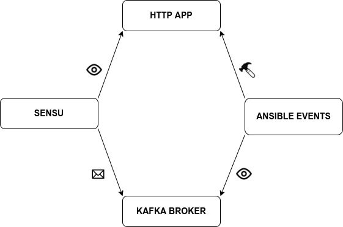

# Ansible Events + sensu + kafka DEMO

## Description

In this demo we will deploy a stack based on a simple web application which is being monitored by a sensu instance.
Sensu will forward the events to a topic in kafka and a rule set of ansible-events will listen those messages and react
when the web application is down to recover it.



## Requirements

- [docker](https://docs.docker.com/engine/install/) or [podman](https://podman.io/getting-started/installation) engine
- [docker-compose](https://docs.docker.com/compose/install/)

## Usage

First, we will deploy the whole stack. From `demos/sensu-kafka` dir, run:

```sh
docker-compose up -d
```

After everything is up, we are able to access the sensu UI with credentials: admin/admin
and we will see the entity of our web application in green state: <http://localhost:3000/c/~/n/default/entities>

Sensu checks the /health endpoint of our web application, returning a good state:

```sh
curl http://localhost:5080/health
{"status": "RUNNING"}
```

In another shell session we can see the output of our ansible-events instance, where we can not see any message yet.

```sh
docker-compose logs -f ansible-events
```

Now we will simulate an outage in our web application, open a new terminal session and run:

```sh
curl http://localhost:5080/down
```

Now our app is down:

```sh
curl http://localhost:5080/health
{"status": "ERROR: application unavailable"}
```

If you come back to the sensu UI you will see our entity in red state.
If you see the output of the ansible-events pod you will see that ansible-events has received the event,
matches the outage condition and as a consecuence has executed a playbook to fix our web application.

After some seconds you will see that our web application is up and running again:

```sh
curl http://localhost:5080/health
{"status": "RUNNING"}
```

Finally we can shutdown the demo environment:

```sh
docker-compose down -v
```

## Troubleshooting

For any issue in the pods startup we suggest running the `docker-compose up` command (without the `-d` flag) to see the complete output and be able to determine the error. The most common issue is related with networking. Be sure that you don't have any other pod with the ports 5080, 9092, 3000, 8080, 8081 mapped. Has been detected startup issues with sensu-backend and/or kafka broker related with the python version of docker-compose and podman v3. The pods can not resolve their own hostname. In this case we recommend the latest version of docker-compose (>= 2.7) written in go.
